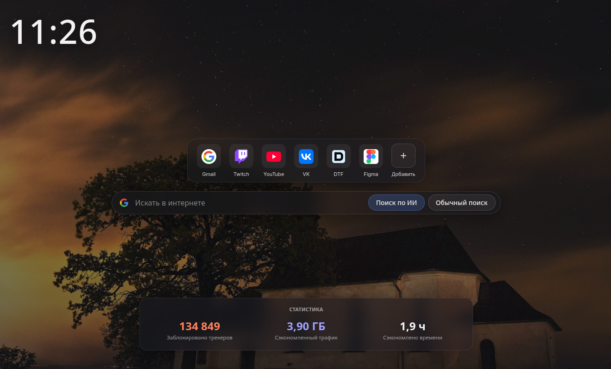

# Browser Start Page

Стартовая страница для браузера в стиле Brave.



## Функционал
* Рандомные фоны (сервис picsum.photos), загружает по 3 фона, удаляя 3 старых, и рандомит. Всегда разные картинки
* Закладки сайтов с иконками, возможность перетаскивать их для сортировки. Закладки хранятся локально в bookmarks.json и по SSR встраиваются в страницу, чтобы ничего не дёргалось.
* Поиск по Google с режимом ИИ по умолчанию
* Статистика из Brave. Информацию статистики Brave Go-сервис ищет по системе, если не находит — скроет блок.

## Зачем это?
У меня были на это личные причины. 
Первое: стандартная страница в Brave поменялась на более кривую, хотя предыдущая была более совершенная и эстетичная.
Второе: для закладок есть ограничение в буквально несколько штук (то ли 8, то ли 10) — этого может быть очень мало, не удобно.
Третье: в Google появился поиск по ИИ, и всё чаще ищется всё через него. Приходится вбивать тарабарщину вроде fdsrfe и переходить на вкладку ИИ.

Ни на что не претендую, ничего не гарантирую. Если вам это надо, используйте как есть. Если что-то поменяется — откатывайтесь на ту версию, которая вам понравится, но вводить фичи я буду прежде всего для себя, если я этого захочу :)

## Установка

**Brave (новая вкладка):** [`extension/README.md`](extension/README.md) — `make extension`, загрузить папку `extension`, сервер `./browser-startpage`. Без расширения только домашняя страница `http://127.0.0.1:7777` (URL в адресной строке, фокус в омнибоксе).

### Docker

1. Установить Docker + Docker compose (или Docker Desktop для Windows)
2. Перейти в папку загруженного репозитория
3. Запустить `make dev`

### Исполняемый файл

Нужны Go 1.22+, gcc и библиотеки трея (Arch: `gtk3 libayatana-appindicator-gtk3`).

```bash
make build   # только собрать ./browser-startpage
make run     # собрать (если нужно) и запустить сервер
```

В трее появится иконка; **Выход** останавливает сервер. Без трея: `BROWSER_PAGE_NO_TRAY=1 make run`.

Бинарник в корне репозитория: `./browser-startpage`.

### Расширение

Расширение нужно для фокуса в поиске на Ctrl+T и для **подсказок из истории** браузера (стрелки ↑↓, Enter — переход).

```bash
make run
# brave://extensions → extension/ → Обновить
# brave://settings/newTab → «Пустая страница»
```

Подробнее: [`extension/README.md`](extension/README.md).
